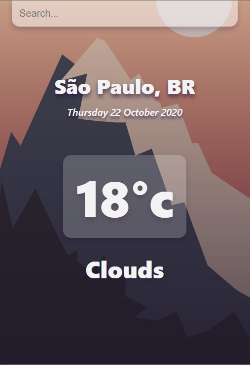

# Weather_App
## ** A simple weather application base on a tutorial from Tyler Potts **
But still theres somethings i'd like to add

- [x] Change the backgroud based on the temperature
- [ ] Change the background base on (raining, snowing, blablablawhiskasache)
- [ ] Add animations

---

---

It's a very simple ui, i didn't change much from the tutorial and its something i'd like to do in the future, that's my first application using react so theres many things to improve.
